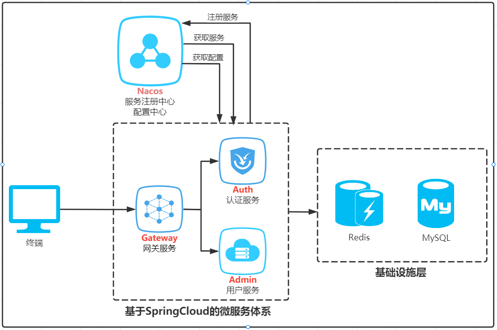
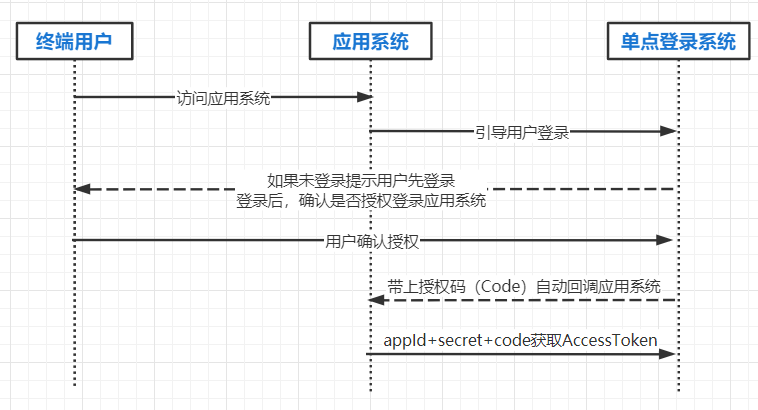

# 如何在分布式环境中搭建单点登录系统

SSO作为企业级软件的基础设施，是大型业务系统不可或缺的组成部分。在Java技术体系内，一般基于Shiro或者SpringSecurity框架开发认证授权功能。  
随着微服务的流行，原来复杂的系统被拆分成职责单一的各个微服务，微服务以无状态（sessionless）的设计形式对外提供。  
在分布式环境下，如何实现统一的认证授权管理，成为一个新的痛点。如何设计一个统一的登录入口，既要支持本系统用户登录，又要支持第三方系统的授权登录以及通过第三方平台（微信，GitHub等）实现社会化登录，是本系列文章要讨论的主要内容。

## 架构设计
工欲善其事，必先利其器。SSO属于微服务体系的一个基本组成，运行于微服务体系架构之上。SpringCloud开源框架是目前微服务体系架构的首选。  
为了方便对单点登录系统的设计进行阐述，我们先基于SpringCloud搭建微服务架构。系统通过nacos实现服务的注册与发现。以SpringCloudGateway作为网关，实现前后端分离。结合 Spring Security OAuth2扩展，采用统一的认证中心，保障REST API的安全性。

## 技术栈
* 开发框架：Spring Boot 2.5
* 微服务框架：Spring Cloud 2020
* 安全框架：Spring Security + Spring OAuth 2.0
* 服务注册与发现: Nacos
* 客户端负载均衡：Spring Cloud Loadbalancer
* 网关组件：Spring Cloud Gateway
* 前端框架：Vue2 + element-ui
## 模块说明
SSO  
├── sso-h5 -- 前端工程  
├── sso-java -- 后端功能  
├    ├── sso-core -- 公共工具类核心包  
├    ├── gateway -- 基于SpringCloudGateway的网关服务  
├    ├── auth -- 基于Spring Security OAuth2的认证服务  
├    ├── admin -- 基于RBAC的用户服务
## 认证授权时序图
通过整合 Spring Security OAuth2 实现整个框架安全认证，并通过扩展实现社会化登录。

## 系统源码
为了方便对SSO的细节进行说明，已经系统源码上传到gitee上，有兴趣的可以直接下载阅读。  
https://gitee.com/code-it-yourself/sso

